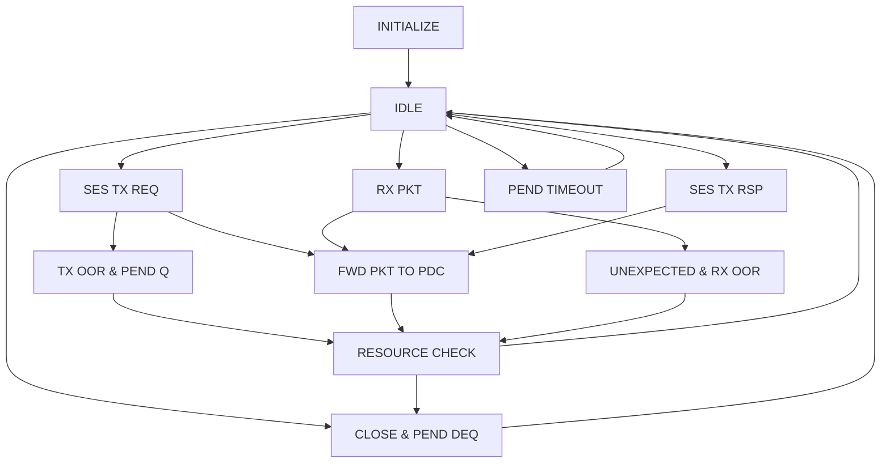

---
{"dg-publish":true,"permalink":"/03_论文阅读/UEC白皮书/PDS管理层/PDS_Manager_技术深度分析/"}
---

# PDS Manager技术深度分析

## 1. 状态转换逻辑完整性分析

### 1.1 状态机图中的转换路径分析

基于提供的状态机图，我识别了以下关键转换路径：

#### 1.1.1 正常流程转换路径


#### 1.1.2 代码中的实际转换逻辑
```cpp
// 主处理循环 - 缺少明确的状态管理
void pds_manger_sm_process() {
    // 处理各种队列，但没有状态转换逻辑
    while(!eager_req_q.empty()) { /* 处理eager请求 */ }
    while(!tx_q.empty()) { /* 处理TX请求 */ }
    while(!rx_q.empty()) { /* 处理RX请求 */ }
    while(!pdc_close_q.empty()) { /* 处理关闭请求 */ }
    while(!error_q.empty()) { /* 处理错误事件 */ }
}
```

### 1.2 转换逻辑缺失分析

| 状态转换 | 状态机图要求 | 代码实现 | 缺失程度 |
|---------|-------------|---------|----------|
| IDLE→状态选择 | 基于事件类型的条件转换 | 基于队列优先级的顺序处理 | 🔴 严重缺失 |
| 状态间转换 | UCT和条件转换 | 函数调用，无状态记录 | 🔴 严重缺失 |
| 错误状态处理 | 明确的错误恢复路径 | 简单的错误队列处理 | 🟡 部分缺失 |
| 资源检查触发 | 特定条件触发 | 在多个位置调用 | 🟡 部分缺失 |

## 2. 资源管理和PDC分配算法深度分析

### 2.1 PDC分配算法分析

#### 2.1.1 当前算法实现
```cpp
int mux_tx_to_pdc_id(struct ses_tx *tx) {
    // 简单的求和取模算法
    int sum = tx->JobID + tx->destinationFA + tx->trafficclass + tx->deliverymode;
    return sum % MAX_PDC;
}
```

**问题识别**：
- ❌ 算法过于简单，可能导致负载不均衡
- ❌ 没有考虑PDC的实际使用情况
- ❌ 缺少冲突检测和处理机制
- ❌ 没有考虑PDC的状态（打开/关闭）

#### 2.1.2 改进算法建议
```cpp
// 建议实现的改进算法
enum PDC_Selection_Strategy {
    ROUND_ROBIN,    // 轮询
    LEAST_LOADED,   // 最少负载
    HASH_BASED,     // 基于哈希
    WEIGHTED        // 加权分配
};

class PDC_Allocator {
private:
    PDC_Selection_Strategy strategy;
    std::vector<int> pdc_load_counter;  // PDC负载计数器
    int next_round_robin_id;            // 轮询索引
    
public:
    int select_optimal_pdc(const ses_tx* tx, bool consider_load = true);
    void update_pdc_load(int pdc_id, int delta);
    std::vector<int> get_available_pdcs();
};
```

### 2.2 资源管理策略分析

#### 2.2.1 当前资源管理逻辑
```cpp
void resouce_check() {
    if(pend_cnt > 0 || (open_cnt - closing_cnt > Close_Thresh)) {
        // 超时检查
        while(!pend_q.empty() && is_pend_node_over_time(pend_q.front())) {
            // 处理超时节点
        }
        
        int sPDCID = select_pdc_2close(); // 简单选择第一个开放的PDC
        // 生成关闭请求
    }
}
```

**资源管理问题分析**：
- 🔴 **PDC选择策略过于简单**：只选择第一个开放的PDC
- 🟡 **资源阈值管理不灵活**：硬编码的Close_Thresh
- 🟡 **负载均衡考虑不足**：没有考虑PDC的实际负载情况
- 🔴 **资源释放时机不合理**：可能过早或过晚关闭PDC

#### 2.2.2 建议的资源管理策略
```cpp
class Resource_Manager {
public:
    enum PDC_Close_Strategy {
        LRU,        // 最近最少使用
        FIFO,       // 先进先出
        LOAD_BASED, // 基于负载
        HYBRID      // 混合策略
    };
    
    struct PDC_Stats {
        int last_used_time;
        int total_packets;
        int current_load;
        bool is_locked;  // 是否被锁定不能关闭
    };
    
private:
    std::array<PDC_Stats, MAX_PDC> pdc_stats;
    PDC_Close_Strategy close_strategy;
    
public:
    int select_pdc_to_close();
    void update_pdc_usage(int pdc_id);
    bool should_close_pdc(int pdc_id);
    void set_pdc_lock(int pdc_id, bool locked);
};
```

### 2.3 队列管理优化分析

#### 2.3.1 当前队列处理逻辑
```cpp
// 固定优先级处理，缺乏灵活性
while(!eager_req_q.empty()) { /* 优先级1 */ }
while(!tx_q.empty()) { /* 优先级2 */ }
while(!rx_q.empty()) { /* 优先级3 */ }
while(!pdc_close_q.empty()) { /* 优先级4 */ }
while(!error_q.empty()) { /* 优先级5 */ }
```

**队列管理问题**：
- 🔴 **优先级固化**：无法根据系统状态动态调整
- 🟡 **公平性不足**：高优先级队列可能饿死低优先级队列
- 🟡 **缺少QoS支持**：无法根据业务重要性调整处理顺序

## 3. 错误处理和超时机制评估

### 3.1 当前错误处理机制分析

#### 3.1.1 错误处理覆盖情况
| 错误类型 | 检测机制 | 处理机制 | 恢复机制 | 完整性评估 |
|---------|---------|---------|---------|-----------|
| PDC分配失败 | ✅ `assign_pdc()` | ✅ 进入等待队列 | ✅ 资源释放后重试 | 🟢 良好 |
| 超时处理 | ✅ `is_pend_node_over_time()` | ✅ `pend_timeout()` | ✅ 丢弃+错误通知 | 🟢 良好 |
| RX包验证失败 | ✅ `check_rx_pkt()` | ✅ 进入UNEXPECTED处理 | ⚠️ 部分实现 | 🟡 一般 |
| SES通信错误 | ❌ 缺失 | ❌ 占位函数 | ❌ 无恢复机制 | 🔴 差 |
| PDC接口错误 | ❌ 缺失 | ❌ 占位函数 | ❌ 无恢复机制 | 🔴 差 |

#### 3.1.2 关键错误处理函数分析

**已实现但需要完善的函数**：
```cpp
void send_error_to_ses() {
    // 向ses发送错误 后面根据实际需求完善
    std::cout << "Sending Error to SES" << std::endl;
    // ❌ 缺少实际的错误通知机制
    // ❌ 缺少错误码定义
    // ❌ 缺少错误恢复策略
}

void drop_packet() {
    // 占位 暂时为空
    std::cout <<"Drop Packet Compelete"<< std::endl;
    // ❌ 缺少实际的包丢弃处理
    // ❌ 缺少统计信息更新
    // ❌ 缺少资源清理
}
```

### 3.2 超时机制深度分析

#### 3.2.1 当前超时处理实现
```cpp
bool is_pend_node_over_time(pend_node node) {
    auto pend_end = std::chrono::steady_clock::now();
    int time_now_ms = static_cast<int>(
        std::chrono::duration_cast<std::chrono::milliseconds>(
            pend_end.time_since_epoch()
        ).count()
    );
    return node.end_time > time_now_ms; // ❌ 逻辑错误：应该是 < 
}
```

**超时机制问题**：
- 🔴 **逻辑错误**：超时判断条件错误
- 🟡 **超时策略单一**：只有固定的Pend_Timeout
- 🟡 **缺少分级超时**：没有根据请求类型设置不同超时时间
- 🔴 **时间管理不一致**：时间戳处理可能存在精度问题

#### 3.2.2 建议的超时管理机制
```cpp
class Timeout_Manager {
public:
    enum Timeout_Type {
        PEND_TIMEOUT,
        PDC_ALLOC_TIMEOUT,
        SES_RESPONSE_TIMEOUT,
        PDC_CLOSE_TIMEOUT
    };
    
    struct Timeout_Config {
        std::chrono::milliseconds base_timeout;
        std::chrono::milliseconds max_timeout;
        int retry_count;
        double backoff_factor;
    };
    
private:
    std::map<Timeout_Type, Timeout_Config> timeout_configs;
    std::priority_queue<Timeout_Event> timeout_events;
    
public:
    void register_timeout(Timeout_Type type, void* context, 
                         std::chrono::milliseconds timeout);
    void check_timeouts();
    void cancel_timeout(void* context);
    void update_timeout_config(Timeout_Type type, const Timeout_Config& config);
};
```

## 4. SES和PDC层接口对接分析

### 4.1 SES接口分析

#### 4.1.1 当前SES接口状态
```cpp
// SES接口相关的结构体定义完整
struct ses_tx {
    int type, JobID, destinationFA, trafficclass, deliverymode, msgid, spdcID, dpdcID;
};

struct ses_rx {
    int type, JobID, destinationFA, trafficclass, deliverymode, msgid, spdcID, dpdcID;
};

// 但缺少实际的接口函数实现
void send_error_to_ses() {
    // ❌ 占位实现，缺少实际功能
}
```

**SES接口问题分析**：
- 🔴 **接口函数缺失**：缺少与SES层的实际通信函数
- 🔴 **错误通知机制不完整**：无法有效通知SES层错误信息
- 🟡 **数据结构不完整**：SES相关结构体字段可能不全
- 🔴 **回调机制缺失**：缺少SES层的回调处理

#### 4.1.2 建议的SES接口设计
```cpp
class SES_Interface {
public:
    // 向SES层发送响应
    virtual int send_response_to_ses(const ses_tx& request, 
                                   const Response_Result& result) = 0;
    
    // 向SES层报告错误
    virtual int report_error_to_ses(const Error_Info& error) = 0;
    
    // 向SES层请求暂停/恢复
    virtual int request_ses_pause(bool pause) = 0;
    
    // 从SES层接收请求
    virtual int receive_from_ses(std::queue<ses_tx>& tx_queue,
                               std::queue<ses_rx>& rx_queue) = 0;
};

enum Error_Type {
    PDC_ALLOCATION_FAILED,
    TIMEOUT_ERROR,
    RESOURCE_EXHAUSTED,
    PROTOCOL_ERROR
};

struct Error_Info {
    Error_Type type;
    int error_code;
    std::string description;
    uint32_t jobid;
    uint16_t msg_id;
};
```

### 4.2 PDC接口分析

#### 4.2.1 当前PDC接口状态
```cpp
void fwd_pkt_to_pdc(struct pkt_to_pdc *pkt) {
    if(pkt->type == 1) {
        std::cout << "Forwarding TX Packet to sPDCID:" << pkt->tx.spdcID << std::endl;
        // ❌ 这里向外传输 需要跟下方实际pdc对接
    }
    // ❌ 缺少实际的PDC接口调用
}
```

**PDC接口问题分析**：
- 🔴 **接口函数占位**：转发函数没有实际实现
- 🔴 **PDC状态同步缺失**：无法获取PDC的实际状态
- 🔴 **数据包格式转换缺失**：没有将内部格式转换为PDC格式
- 🔴 **错误反馈机制缺失**：无法从PDC获取处理结果

#### 4.2.2 建议的PDC接口设计
```cpp
class PDC_Interface {
public:
    // PDC控制接口
    virtual int create_pdc(int pdc_id, const PDC_Config& config) = 0;
    virtual int close_pdc(int pdc_id) = 0;
    virtual PDC_Status get_pdc_status(int pdc_id) = 0;
    
    // 数据包转发接口
    virtual int forward_tx_packet(int pdc_id, const TX_Packet& packet) = 0;
    virtual int forward_rx_packet(int pdc_id, const RX_Packet& packet) = 0;
    
    // 状态查询接口
    virtual bool is_pdc_available(int pdc_id) = 0;
    virtual int get_pdc_load(int pdc_id) = 0;
    
    // 错误处理接口
    virtual int handle_pdc_error(int pdc_id, const PDC_Error& error) = 0;
};

enum PDC_Status {
    PDC_CLOSED,
    PDC_OPENING,
    PDC_ESTABLISHED,
    PDC_CLOSING,
    PDC_ERROR
};
```

## 5. 性能和可靠性分析

### 5.1 性能瓶颈分析

#### 5.1.1 当前性能问题
| 性能方面 | 当前实现 | 潜在问题 | 影响程度 |
|---------|---------|---------|----------|
| 队列处理 | 顺序处理所有队列 | 队列阻塞，影响整体吞吐 | 🔴 高 |
| PDC选择 | 简单哈希算法 | 负载不均，热点问题 | 🟡 中 |
| 内存管理 | 标准STL容器 | 频繁分配释放，碎片化 | 🟡 中 |
| 锁竞争 | 当前无并发控制 | 多线程扩展困难 | 🟠 低 |

#### 5.1.2 性能优化建议
```cpp
class Performance_Optimizer {
    // 批处理机制
    struct Batch_Config {
        int max_batch_size;
        std::chrono::milliseconds max_wait_time;
    };
    
    // 内存池管理
    class Memory_Pool {
        std::vector<void*> free_blocks;
        size_t block_size;
    public:
        void* allocate();
        void deallocate(void* ptr);
    };
    
    // 无锁队列实现
    template<typename T>
    class Lock_Free_Queue {
        std::atomic<Node*> head;
        std::atomic<Node*> tail;
    public:
        void enqueue(const T& item);
        bool dequeue(T& result);
    };
};
```

### 5.2 可靠性分析

#### 5.2.1 可靠性风险评估
| 风险类型 | 风险描述 | 当前防护 | 风险等级 |
|---------|---------|---------|----------|
| 资源泄漏 | PDC资源未正确释放 | 基本的释放逻辑 | 🟡 中 |
| 死锁 | 队列处理顺序导致死锁 | 无并发控制 | 🟠 低 |
| 数据不一致 | 计数器更新不同步 | 无同步保护 | 🔴 高 |
| 异常恢复 | 异常情况下状态恢复 | 基本错误处理 | 🟡 中 |

#### 5.2.2 可靠性增强建议
```cpp
class Reliability_Manager {
    // 状态一致性检查
    bool check_state_consistency();
    
    // 资源泄漏检测
    void detect_resource_leaks();
    
    // 异常恢复机制
    void recover_from_exception(const std::exception& e);
    
    // 健康检查
    struct Health_Status {
        bool is_healthy;
        std::vector<std::string> issues;
        std::chrono::system_clock::time_point last_check;
    };
    
    Health_Status perform_health_check();
};
```

## 6. 重构优先级和实施计划

### 6.1 紧急修复项（P0）
1. **修复超时判断逻辑错误**
   ```cpp
   // 当前错误的实现
   return node.end_time > time_now_ms; 
   // 应该改为
   return time_now_ms > node.end_time;
   ```

2. **实现基础的SES和PDC接口**
3. **修复资源计数不一致问题**

### 6.2 核心功能完善（P1）
1. **实现完整的状态机模式**
2. **改进PDC分配算法**
3. **完善错误处理机制**
4. **实现更好的资源管理策略**

### 6.3 性能和扩展性优化（P2）
1. **队列处理优化**
2. **并发安全改进**
3. **性能监控和统计**
4. **可配置的策略参数**

### 6.4 高级功能增强（P3）
1. **QoS支持**
2. **动态负载均衡**
3. **高级错误恢复机制**
4. **详细的日志和监控系统**

## 7. 结论

PDS Manager的实现在基本功能方面已经具备了一定的基础，但距离一个完整、可靠、高性能的状态机实现还有较大差距。主要问题集中在：

1. **架构层面**：缺少真正的状态机实现
2. **接口层面**：与SES和PDC的接口不完整
3. **算法层面**：资源管理和分配算法过于简单
4. **可靠性层面**：错误处理和恢复机制不完善

建议采用分阶段的重构策略，优先解决紧急问题和核心功能，然后逐步完善性能和可靠性。